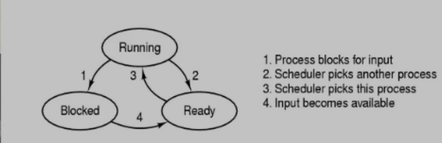
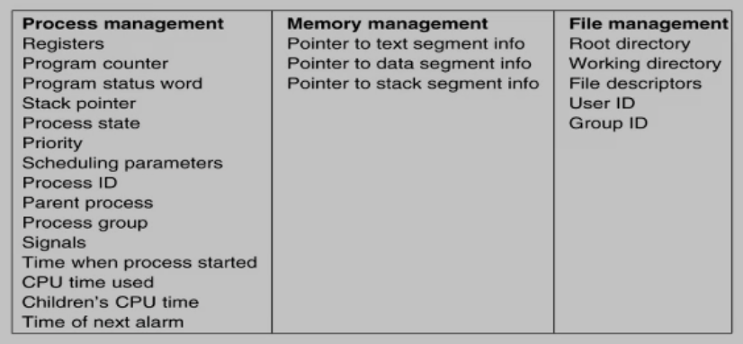
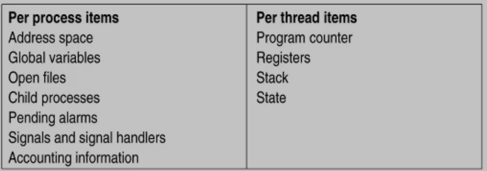

[TOC]

# 1 进程(process)
> 定义:
进程:正在运行的程序
内核:操作系统本身

## 1.1 内部结构(internal structure): 
* 代码段(segment)
* 栈段
    >存储局部变量,返回地址
    >区分进程和程序的重要之处
* 数据段
* 地址空间
    * 内核地址空间
    * 用户地址空间
        > 分开因权限问题
    * 内核态:内核空间+内核权限
    * 用户态:用户空间+用户权限
        > 硬件提供
* PCB(process control block)
    > 保存进程被中断时的信息(上下文context概念?)

## 1.2 状态(States)

* 状态保存在PCB中
## 1.3 何时生成(Creation)
* 系统初始化
    > Linux所有进程都有一个共同的父进程,ID为0(1)
    > 这个进程进行系统调用,生成应用进程
* 系统调用
* 用户要求
    > shell要求,服务器请求
* 初始化批处理命令(shell脚本)
## 1.4 进程生成和结构的关系
> shell键入命令,bash进程解析命令,将程序加载到内存,解析出代码段数据段放到分开的内存空间,然后生成一个栈段.(自然生成了地址空间(内核地址空间进程共享)).
内核中生成PCB等待调度

> 子进程拷贝父进程的代码段数据段,栈段(PID不同),PCB(有修改)
****
### 1.4.1 fork() [CSAPP-note day10 虚拟内存]
> 内核为新进程创建各种数据结构,分配PID.
为新进程创建虚拟内存,创建原始副本,两个进程的每个页面标为只读,每个区域结构标为私有的写时复制.
fork()返回时新老进程的虚拟内存相同,任意一个写操作触发写时复制.

>返回2次:
在父进程中，fork返回新创建子进程的进程ID;
在子进程中，fork返回0;
如果出现错误，fork返回一个负值;

>新进程从fork()返回处开始执行
### 1.4.2 exec()
> 覆盖当前进程,初始化栈等
****
## 1.5 结束(Termination)
* 结束类型:
    * 正常退出(Normal exit)
    * 错误退出(Error exit)
        * 自己发现错误自己退出
    * 严重错误 (Fatal error)
        * 如写只读指针
    * 被其他进程kill
* 结束:
    * 释放代码段,数据段,PCB
* 僵尸进程:
    * 资源没有彻底释放
> kill父进程, 子进程也同时被结束回收

## 1.6 PCB(process control block)

## 1.7 进程切换

## 1.8 进程性能评测
$=1-P^n$(n:进程数 P:IO等待概率)
****
# 2 线程(Thread)
> 定义:
线程: 进程中一个正在执行的代码片段,可以和该进程中其他代码片段并发执行

## 2.1 why thread
* 无需拷贝代码段数据段,节省时间(创建成本小于进程)

## 2.2 特性
* thread共享同进程中其他线程的代码段数据段,栈不共享(但可以通过指针访问)

## 2.3 thread内部结构

## 2.4 线程模型
* 进程内调度

## 2.5 TCB(thread control block)

## 2.6 3种实现方式
* 用户态下(in user space)
    >线程调度在用户态下实现,操作系统调度进程,进程调度线程调度器
* 内核态下(in kernel space)
    > 线程内核可见,操作系统调度单位变为线程
> 用户态下进程中某个线程堵塞会使得整个进程堵塞,内核态则不会
内核态每次线程调度需要陷入内核,成本高
* 混合实现(hybrid)
    > 进程中某个线程堵塞,内核得知后会通知用户态下调度器.

## 2.7 Posix Thread
> 统一线程实现接口标准

## 2.8 Pop-Up Thread
> 一种以线程提供Web服务的方式