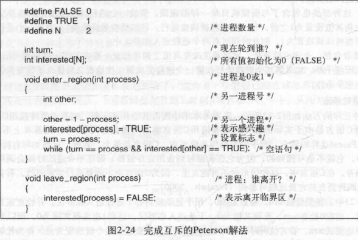
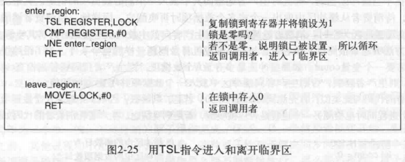
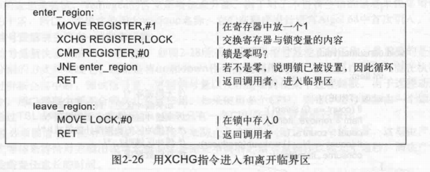
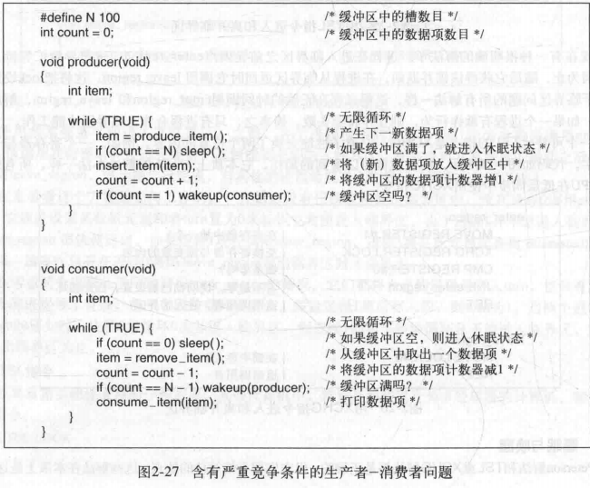
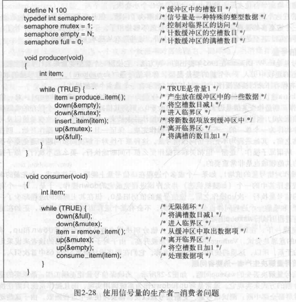
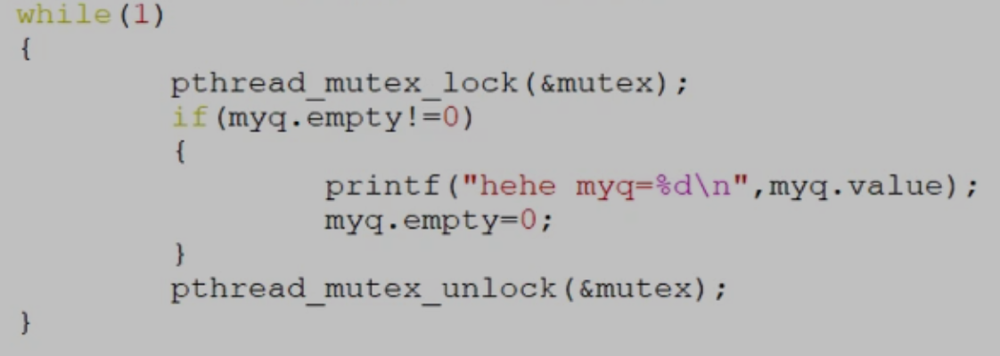
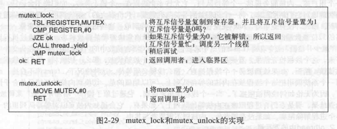
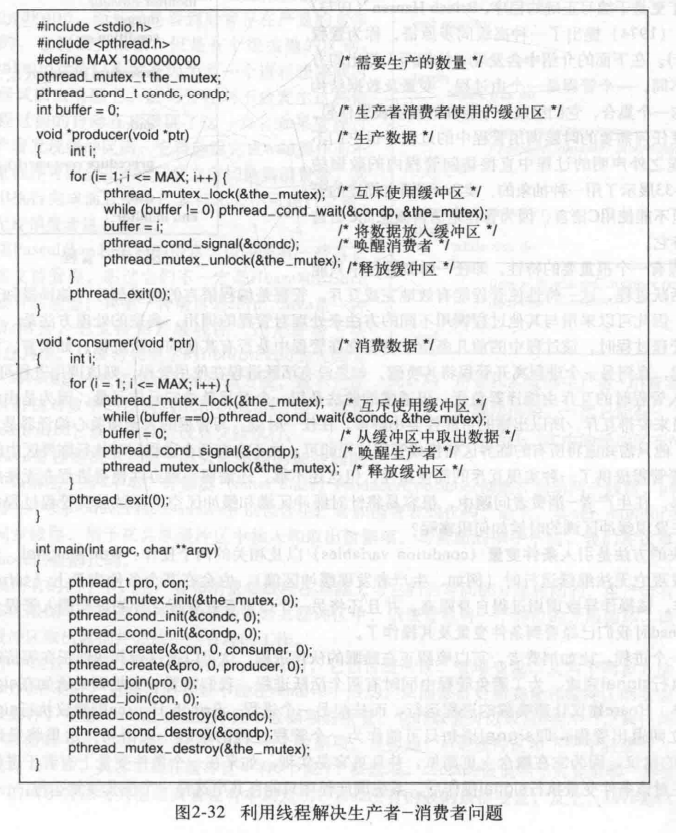

[TOC]
<font face = "Consolas">

# 1 IPC(inter process communication进程间通信)
## 1.1 竞争条件(Race conditions)
> 进程共享某些共用存储区
## 1.2 临界区(Critical Region)
> 互斥访问,避免临界区的竞争
**临界区**: 对共享内存进行访问的**程序片段**
* 条件:
>1)任何两个进程不能同时处于其临界区
2)不应对CPU的速度和数量做任何假设
3)临界区外运行的进程不得阻塞其他进程
4)不得使进程无限期等待进入临界区
## 1.3 互斥方案
### 1.3.1 屏蔽中断
>单处理器系统中,每个进程刚进入临界区后立即屏蔽所有中断(包括时钟中断),CPU就不会切换到其他进程,离开时打开中断
* 缺点: 
    把屏蔽中断的权力交给用户进程
    对CPU数量作了假设
* 优点: 
    对内核来说很方便
    > 屏蔽中断对操作系统而言实用,对用户进程不实用
### 1.3.2 锁变量
> 定义一个共享的锁变量
进程在进入时测试锁,为0可进入则将其置1进入,退出置0.为1则等待直至0
* 缺点:
    需要将锁变量存在共享内存
    读取,修改为多步操作,容易出现冲突
### 1.3.3 严格轮换法
> 锁变量记录轮到哪个进程进入临界区,轮流进入
**忙等待**: 连续测试一个变量直到某个值出现(浪费CPU时间)
* 缺点:
    规定了进程执行的顺序
    无法完全利用临界区,可能快的进程需等待慢进程先使用临界区
### 1.3.4 Peterson解法
> 依旧是两个进程竞争,但不需严格轮换


* 只有一个进程进入时(如0):
    > turn置0,因other为false,0直接进入临界区
* 两个进程同时进入:
    > 假设0先置turn,1也置了interested,在0的while中满足无限循环,直到1将turn置1,0进程才可进入,此时1进程的while满足无限循环.0退出后1的while才不满足,进入临界区
### 1.3.5 TSL
> 一个CPU指令 
TSL REGISTER,LOCK
将LOCK的原值读到REGISTER中,然后将LOCK置1(测试并加锁)
即先锁住LOCK,然后测试LOCK的原值
执行TSL时CPU锁住内存总线,指令结束前其他处理器不许访问内存


如LOCK原来是0(没加锁),则RET进入临界区
* XCHG
    
    >即模拟TSL
* 缺点:
    都是忙等待
    优先级反转问题:有优先级时高优先级进程就绪会使得在临界区中的低优先级进程无法被调度,就无法离开临界区
### 1.3.6 Sleep&Wakeup
> 解决忙等待问题
* producer-consumer问题
    
    * 缺陷: 如果count为0时consumer先执行到while第一句,完成if后还没sleep时调度到了producer,producer生产了一件后wakeup consumer,但consumer还没sleep所以wakeup无效,后调度回consumer时sleep,永远无法被唤醒
## 1.4 改进
> 解决wakeup的缺陷
> 区别:
mutex是服务于共享资源的；而semaphore是服务于多个线程间的执行的逻辑顺序的。
### 1.4.1 信号量(Semaphore)

> 将检查和睡眠操作变为一个原子操作,不可中断
mutex保护临界区
P down, V up
* 缺点:
    Semaphore存放在内核态(多个进程使用),用户态内核态切换时耗费时间
#### 1.4.1.1 semaphore(信号量)//day13 三种并发编程 
> 信号量s是非负整数全局变量,只由两种特殊操作处理,P,V
* P(s)(Proberen测试): 一定减1,如为0则挂起直到s非0(等待V重启)
* V(s)(Verhogen增加): 一定加1.如果有任意线程阻塞在P(等待s变为非0),V会将其重启
    > 测试,加减,存储不能有中断
    V只能重启一个等待线程,但没有定义重启的顺序,多个线程等待时无法预测
* 信号量不变性: 正确初始化过的信号量不可能有负值

### 1.4.2 互斥量(mutex)
> 将信号量放在用户态下实现(简化版Semaphore)
多为同进程中多个线程使用
只有01

```
#include <pthread.h>
pthread_mutex_t mutex = PTHREAD_MUTEX_INITIALIZER;
```


> 无需任何内核调度
在线程中没有时钟停止运行(enter_region有),忙等待的结果是容易造成死锁,所以调用thread_yield放弃CPU给另一个线程,该线程下次运行时再测试
* 缺点: 条件不符时空转,效率低

### 1.4.3 条件变量(Conditional Variables)
> 无内核调度的同时解决了空转问题
```
struct queue myq;
pthread_mutex_t mutex=PTHREAD_MUTEX_INITIALIZER;
pthread_cond_t, cond2;
void *th(void *p)
{
    int x;
    x=0;
    while(1)
    {
        pthread_mutex_lock(&mutex);
        if(myq.empty==0)
        {
            myq.empty=1;
            myq.value=x++;
            pthread_cond_signal(&cond);//唤醒cond睡眠队列上的线程
        }
        else
            pthread_cond_wait(&cond2,&mutex);//让线程在cond队列进入睡眠,释放mutex,唤醒时加锁mutex
        pthread_mutex_unlock(&mutex);
    }
}

int main()
{
    myq.empty = 0;
    myq.value = 0;
    pthread_t myt,mytl;
    pthread_create(&myt,NULL,th,NULL);
    while(1)
    {
        pthread_mutex_lock(&mutex);
        if(myq.empty != 0)
        {
            printf("hehe myq=%d\n",myq.value);
            myq.empty = 0;
            pthread_cond_signal(&cond2);
        }
        else
            pthread_cond_wait(&cond,&mutex);
        pthread_mutex_unlock(&mutex);
    }
}
```
<details>
<summary><mark>考试例子</summary>

</details>

### 1.4.4 管程(monitor)
> 高级语言特性,管程中任意时刻只能有一个活跃进程

## 1.5 消息传递(message passing)
> 解决速度不匹配问题

## 1.6 屏障(Barriers)
> 并行运算时,在每个阶段结尾放置屏障实现同步.