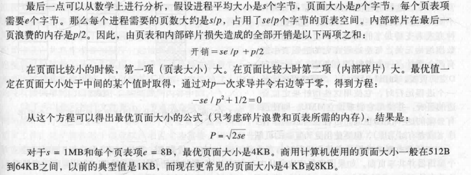

[TOC]

# 1 design issues
> 内存管理的优化

## 1.1 减少缺页中断(Page Fault Reducing)
### 1.1.1 替换页属于哪个进程
> 替换操作的范围
#### 1.1.1.1 局部分配策略(Local)
> 替换本进程中页面
#### 1.1.1.2 全局分配策略(Global)
> 替换全局中
#### 1.1.1.3 缺页中断率算法PFF(Page Fault Frequency)
> 通过缺页中断率动态的分配各进程的页面数
(建立在全局分配策略上)

### 1.1.2 抖动(Thrashing)
> 反复请求最近替换掉的页面
> 一般是因为内存太少
* 解决方法: 控制进程数量

### 1.1.3 清除策略(Clean Policy)
> 不要在内存满时才将脏页写回磁盘,保持内存中有一定空闲的页面

## 1.2 减少内存浪费(Reduce Waste Of Space)
### 1.2.1 调整页面大小
> 过大浪费,过小效率低
#### 1.2.1.1 最优页面大小

## 1.3 增加地址空间(Increase Address Space)
>虚地址空间不够用
 现64位系统已经没有这种需求了(当年16位)
### 1.3.1 分离指令空间和数据空间(Separate instruction and Data Space)
> 分为I空间和D空间,每个空间都有独立的地址空间
通过动态重定位映射回物理空间

## 1.4 共享库(Shared Library)
> 把共享库加载到共享内存中,各进程映射
* 解决的问题:
库文件的链接会浪费程序的存储空间
库升级时要重新编译每个程序
* 存在的问题:
共享库中跳转都要用相对地址

## 1.5 内存映射文件(Memory mapped-files)
> 一个或多个进程将同一个文件映射到自己的内存空间中,都可以读写
对文件读写无需系统调用,可直接用指针访问

## 1.6 针对应用的优化(Optimization for APP)
> 给应用提供访问内存管理的接口
****
# 2 Implementation Issues
****
## 2.1 不同时期的分页工作(time for paging)
### 2.1.1 进程生成(Process creation)
> 确定初始大小(加载程序时程序格式中元信息存储关于代码段数据段的信息)
  生成页表,初始化
### 2.1.2 进程运行(Process execution)
> MMU,TLB
### 2.1.3 缺页中断 (Page fault time)
> 决定替换页面,更改页表
### 2.1.4 进程退出(Process termination time)
> 释放页表

## 2.2 缺页中断处理(Page Fault Handing)
> 处理程序结束后返回引发缺页中断的指令重新执行
  普通中断返回下一条指令

## 2.3 等待IO时的分页处理(Paging With IO)
### 2.3.1 Locking Pages
> 操作系统允许某些页不会被交换
### 2.3.2 Backing Store
> 把交换出去的内存页面存于交换分区或文件上,需要时重新加载

## 2.4 (Separation of Policy and Mechanism)
> 页面替换算法的交换策略放在用户空间下,给应用灵活性

## 2.5 Segmentation
> 段,用于地址空间不够的情况(现在64位基本不存在)