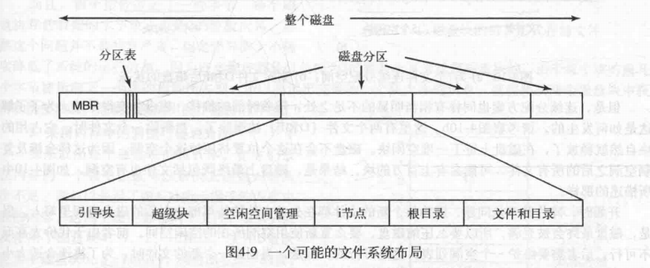
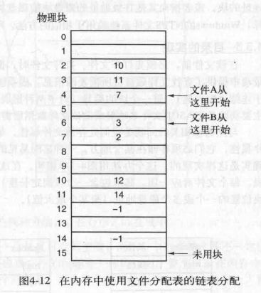
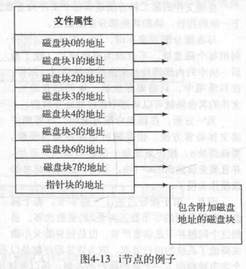
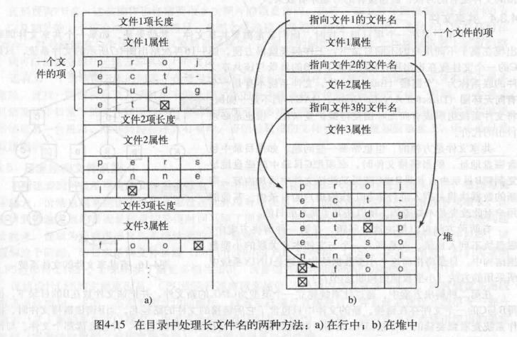

[TOC]

# 1 File system Implementation
> 文件和目录如何存储,磁盘空间如何管理,系统如何工作

## 1.1 文件系统(file system)
### 1.1.1 布局
> 文件系统存放于磁盘上,每个磁盘分区都有独立的文件系统

* MBR主引导记录: 
    >磁盘的0号扇区,在bios引导计算机时执行
* 分区表: 
    >MBR结尾,给出每个分区的起始地址
* 引导块(boot block): 
    >活动分区的第一个块,引导块中的程序装载该分区的操作系统
* 超级块(super block): 
    >包含文件系统的关键参数(如所用的magic number,块的数量等)

    >在文件系统使用时就被读入内存
* 空闲空间管理: 位图或链表
* inode: inode的数组 见下文
> 操作系统装载磁盘的过程:
首先读取MBR,MBR确定装载的活动分区,然后读取活动分区的引导块装载该分区的系统

## 1.2 普通文件(file)
> 解决存储磁盘块分配(allocation),磁盘块追踪(tracking)问题(磁盘块不连续时将其组合)

### 1.2.1 分配(allocation)
#### 1.2.1.1 连续存储
* 优点: 读写快,实现简单,记录每个文件所用的磁盘块简单(只需第一块磁盘地址和文件块数)
* 缺点: 容易有内存碎片(无法预知新文件的大小)
#### 1.2.1.2 指针存储
* 缺点: 每个文件有多个块,链表的随机存储能力差,访问中间某个块速度慢, 指针占用字节使得每个磁盘块存储的字节数不为$2^n$,影响系统运行效率
    > 解决: **FAT** 将所有文件所用用磁盘块的指针存于一张表中放在内存上,快速定位目的地址.
    
    但占用大量内存空间(必须存储空闲块)(可通过只存储打开文件的指针解决,即inode)
### 1.2.2 追踪(tracking)
#### 1.2.2.1 inode索引节点(index node)
> 每个文件有一个inode存储文件属性和列出磁盘块的指针

## 1.3 目录文件
> 目录系统的主要功能是提供将文件名映射成定位文件数据所需的信息
> 目录项在顺序字节集合上如何存储
> 目录项只需存储文件名和文件属性(inode)

如何存放文件名及文件属性:
### 1.3.1 定长存储
> 文件名和文件属性(可用inode)各占据等长的空间
### 1.3.2 变长存储
* ln-line: 在开头记录目录项的长度,后存储固定格式的属性,然后文件名
    * 缺点: 删除时容易形成空洞
* in a heap: 目录项定长部分(固定部分,如长度,固定格式的数据)存在前,变长部分(文件名)存在后
    * 缺点: 需对堆进行管理
* 
## 1.4 链接文件(Link File)
### 1.4.1 硬链接
> 目录项指向同一个索引节点(节点(inode)上记录索引信息(引用次数等))(相当于别名)
* 问题: 该文件被删除时,引用者指向的inode可能无效也可能分配了新的文件,导致连接错误
    > 可通过删除文件时只删除目录项不删除inode解决,inode在引用计数变为0后删除
### 1.4.2 符号链接(symbolic linking)
>文件名指向一个特殊文件(存储指向文件的路径等),使用时将特殊文件中的文本解释成路径寻找

> 符号链接文件不依赖于目标文件,两者互不影响,所以目标文件变化时符号链接文件可能指向无效地址,但不会指向无效的文件
* 问题: 效率低(需要读取路径并遍历得到inode),符号链接的目录项也需inode
