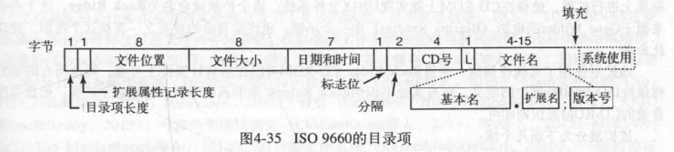
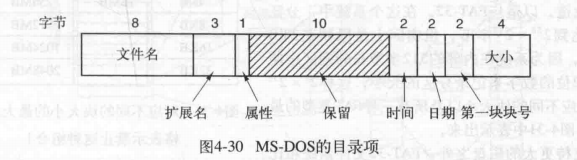
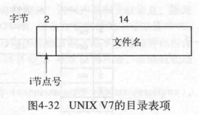
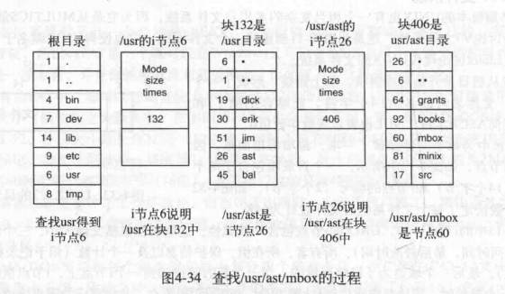

[TOC]

# 1 file system management & optimization
> 文件系统的管理和优化

## 1.1 磁盘空间管理(disk space management)
### 1.1.1 块大小
> 太大浪费空间,太小定位慢,一般是1K
### 1.1.2 空闲块管理
* 链表
* 位图(bit map)
### 1.1.3 磁盘块安全
> 每个用户都有一个Quota pointer(配额指针)指向一个数据结构,给定部分安全指标,如占用块数量,打开文件数量上限(inode数量有限)等.

## 1.2 文件系统可靠性(reliability)
### 1.2.1 备份(backup)
* 直接备份
* 增量式备份
    > 只备份修改的内容
> 问题:
是否压缩 ? 压缩文件出错时难以恢复 : 文件过大
使用时如何备份

* 逻辑备份(logical dump)
    > 考虑文件树,拷贝显式的文件
* 物理备份(physical dump)
    > 不管文件系统形式,直接拷贝物理数据

### 1.2.2 错误恢复(consistency)
> 掉电时恢复回正常状态
* 日志型系统可直接恢复
* 非日志型需得到掉电时正在修改的块,操作系统维护每个块在空闲列表1的次数和被使用列表2的次数,正常情况下的块在两表中的一个,在1中不能同时出现,在2中只能出现一次

### 1.2.3 性能
#### 1.2.3.1 加cache
> 内存中开空间缓存文件系统的文件块
#### 1.2.3.2 提前读(block read ahead)
> 提前将数据读到内存(如提前将块k+1读到高速缓存中)
* 只适用于顺序读取的文件，操作系统通过该文件之前的访问方式综合判断
#### 1.2.3.3 减少磁盘臂移动(reducing disk arm motion)
>在磁盘中部存储inode,或将磁盘划分为柱面组,每组有自己的inode,数据块,空闲表
#### 1.2.3.4 减少碎片(de fragmentation)

### 1.2.4 example
#### 1.2.4.1 ISO9660目录项

* 限制大小的文件名

#### 1.2.4.2 MS-DOS目录项

* 时间项只有2字节16位,存储65536,但一天有86400秒,精确度不够

#### 1.2.4.3 UNIX V7目录项

* 文件名有限制,i节点16位限制了文件总数最大为$2^{16}$

#### 1.2.4.4 UNIX V7目录查找
