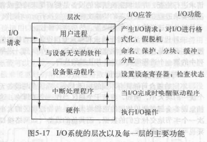
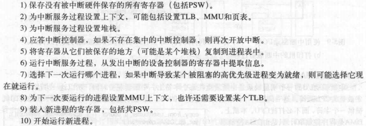

[TOC]
<font face = "Consolas">

```
同步和异步:关注消息通信机制.发出调用后,同步等待调用返回结果,异步则不等待结果,被调用者通过他的方式通知调用者
阻塞与非阻塞:关注等待调用结果时的状态.发出调用等待结果时,阻塞式会挂起直到得到结果,非阻塞不会挂起
```
# 1 Principles of IO software
## 1.1 IO软件目标
### 1.1.1 设备独立性(device independence)
程序可对任意IO设备访问,无需事先指定
### 1.1.2 统一命名(uniform naming)
> 为实现设备独立性

文件或设备的名字都应是简单的字符串或整数(所有文件和IO设备都采用相同的方式寻址)
### 1.1.3 错误处理(error handling)
错误应尽可能在接近硬件的层面处理(控制器->设备驱动程序->高层软件)
### 1.1.4 同步(synchronous)异步(asynchronous)传输
> 同步即阻塞式,异步即中断驱动式

IO设备如果是同步的程序更易编写,所以操作系统将实际上是中断驱动的操作为用户提供为阻塞式(某些性能要求的程序可用异步)
### 1.1.5 缓冲(buffering)
数据离开一个设备后不能直接存放到目的地
> 某些实时约束(音频设备)设备需要不间断的输入,所以将数据预先放置到输出缓冲区中防止缓冲区欠载
### 1.1.6 共享设备和独占设备
某些IO设备可同时让多个用户使用(磁盘),某些则必须独占(磁带机)
> 独占设备引入各种问题,如死锁

## 1.2 三种实现IO的手段
### 1.2.1 程序控制IO(programmed IO)
>即让CPU做全部工作

打印字符串:
1. 用户进程发出系统调用获得IO设备,如果设备被占用就系统调用失败返回错误代码,或阻塞直到设备可用.
2. 然后操作系统将字符串缓冲区复制到内核中一个数组里,如果设备可用就将字符发送给设备的数据寄存器
3. 操作系统查看设备是否就绪接收下一个字符(一般是由设备的另一个寄存器表明状态),然后继续忙等待发送

缺点:
* IO会占用全部CPU时间(因为忙等待)(所以常用于嵌入式系统)
### 1.2.2 中断驱动IO
> 允许CPU在等待设备就绪时可以做其他事情,通过中断实现
1. 用户进程发送系统调用,字符串缓冲区复制到内核空间
2. 设备准备好时接收第一个字符,后CPU调用调度程序将CPU交给某个其他进程
3. 设备打印结束准备好接收下一个字符时,产生一个中断停止当前进程保存其状态,然后运行打设备中断服务过程(如果没有待打印字符就将解除阻塞,有则输出下一个字符,继续调度).

缺点: 中断发生在每个字符上,浪费CPU时间
### 1.2.3 DMA IO
> DMA控制器来给设备提供字符而无需CPU
本质上是程序控制IO,只是用DMA代替CPU

优点: 将中断次数从每个字符一次减少到每个缓冲区一次
缺点: DMA控制器很慢,有时无法全速驱动设备

# 2 IO software layer

## 2.1 中断处理程序
> 大部分中断对IO来说是有害的,所以要将中断隐藏在接近硬件的层次上
通过启动一个IO的驱动程序阻塞,直到IO操作完成发送一个中断

中断发生时,中断处理程序对中断处理后启动中断的驱动程序解除阻塞
中断处理:
>准备好中断服务进程,保存当前状态,应答中断控制器后启动中断服务进程,然后看情况是否选择调度其他进程,如调度则开始上下文切换的准备

## 2.2 设备驱动程序(device driver)
> 设备控制器需要通过IO设备的**设备寄存器**来传递信息

每个连接到计算机的IO设备都需要某些设备特定的代码来对其进行控制
### 2.2.1 功能和特性: 
> 接收抽象的读写请求,和其他某些功能(初始化设备等)
* 一般运行在内核态: 
    >设备驱动程序通常是操作系统内核的一部分(也可能在用户态下通过系统调用读写设备寄存器)
* 需要明确的体系结构: 
    >为了安全性考虑,规定驱动程序的职责以及如何与操作系统的剩余部分相互作用
* 动态装载:
    > 老的操作系统是一个二进制程序,如果添加设备就要重新编译内核增加新的驱动程序.现在操作系统可以动态装载驱动程序
### 2.2.2 驱动程序运作过程
1. 驱动程序启动时自检
2. 驱动程序检查设备当前是否在使用,如果是则将请求列入队列稍后处理,空闲则检查硬件状态,使硬件就绪
3. 驱动程序根据控制设备的命令确定命令序列,将发出的命令写入控制器的设备寄存器,然后检查控制器是否已接收并准备好接收下一个命令.循环直到所有命令发出
4. 驱动程序依情况阻塞等待控制器中断唤醒或不会休眠.然后驱动程序错误检查,将请求数据传递,向调用者返回状态信息.如果还有请求则继续.
* 可重入(reentrant):
    正在运行的驱动程序可以在任意时间点中断而不影响系统

## 2.3 与设备无关的IO软件
>对于一些本应按照与设备无关方式实现的功能因某种原因实际上由驱动程序实现
执行对所有设备公共的IO功能
### 2.3.1 设备驱动程序的统一接口
> 如何使所有IO设备和驱动程序有相同点

每个驱动程序与操作系统的接口应尽量相同,减少驱动程序的内核函数
* 定义标准: 对于每种设备类型操作系统定义一组驱动程序必须支持的函数
* 如何命名?要把符号化的设备名映射到适当的驱动程序
    > Unix每个设备名唯一确定一个特殊文件的inode,这个inode包含主设备号(定位相应驱动程序),次设备号(作为参数传给驱动程序)
* 设备保护: 设备作为命名对象出现在文件系统中,适用于针对文件的常规保护规则.

### 2.3.2 缓冲
> 无缓冲的输入会使得每个字符都要调用用户进程

#### 2.3.2.1 用户空间的缓冲区
直到缓冲区满再唤醒用户进程
* 缺点: 缓冲区可能被分页调出内存(那只能将缓冲区锁定在内存中,收缩可用页面池)
#### 2.3.2.2 内核空间缓冲区
缓冲区满后将用户缓冲区页面调入内存,复制内核缓冲区到用户缓冲区
* 缺点: 复制过程中新来的字符何处放置?(使用双缓冲(double buffering),用2个内核缓冲区轮流使用)
    > 或循环缓冲区(circular buffer)由一块内存区域和2个指针组成,类似循环队列运作.
#### 2.3.2.3 多次缓冲降低性能
> 如网络数据发送过程中,数据包要经过内核缓冲区,控制器缓冲区,接收器缓冲区,接收进程缓冲区,然后接收器返回应答.过多缓冲区降低了传输效率

### 2.3.3 错误报告
> 错误需要设备的驱动程序处理,但错误处理框架相同
* 编程错误:进程请求不可能的事情时
    直接给调用者返回错误代码
* IO错误:读写损坏或已无效的IO
    由驱动程序解决,无法解决则向上传递
>有些错误可以通过用户交互解决,但关键数据结构的破坏无法补救

### 2.3.4 分配与释放专用设备
> 有些设备是独占设备,操作系统需对请求进行检查
* 进程直接在设备的特殊文件上open操作,失败则关闭释放
* 或将调用进程阻塞放入队列等待.
### 2.3.5 与设备无关的块大小
> 磁盘可能用不同的物理扇区大小,但操作系统要求统一的逻辑块大小
* 类似的块大小,字符传输单位等差异应由IO软件实现,对高层隐藏.

## 2.4 用户空间的IO软件
> 大部分IO软件在操作系统内部,但还有部分在用户空间(用在用户程序中的库过程等)

### 2.4.1 假脱机(spooling)系统
处理独占IO设备的一种方法
### 2.4.2 守护进程(daemon)和假脱机目录
假脱机目录记录IO请求,守护进程是可以使用IO设备特殊文件的唯一进程(防止用户直接使用)(解决某些进程长期不必要占用问题)

