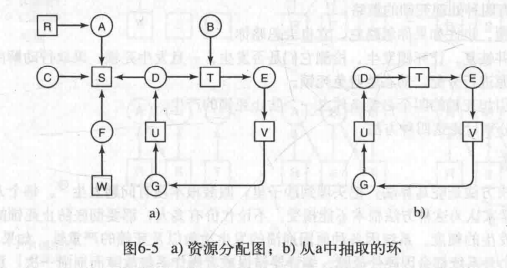
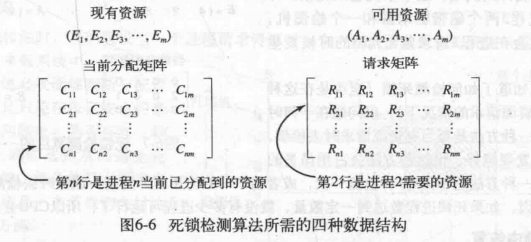
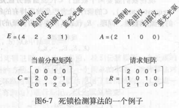
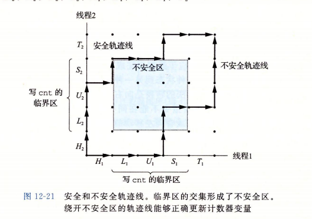
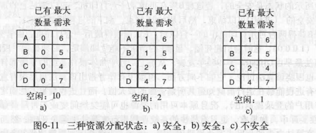
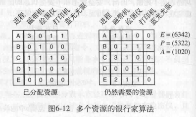
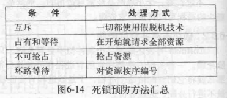

[TOC]

# 1 deadlock
> 操作系统需要具有授权一个进程临时排他地访问某种资源的能力

## 1.1 死锁概念
死锁的规范定义如下:知果一个进程集合中的每个进程都在等待只能由该进程集合中的其他进程オ能引发的事件,那么,该进程集合就是死锁的
>两个进程都请求对方占用的独占性资源且都不释放自身资源,导致两个进程永久性堵塞
### 1.1.1 死锁本质
因资源竞争引发死锁
### 1.1.2 死锁条件
有四个必要条件:
1. 互斥条件(Mutual exclusion)
    >毎个资源要么已经分配给了一个进程,要么就是可用的
2. 占有和等待条件(hold and wait)
    >已经得到了某个资源的进程可以再请求新的资源
3. 不可抢占条件(no preemption)
    >已经分配给一个进程的资源不能强制性地被抢占,它只能被占有它的进程式地释放
4. 环路等待条件(circular wait)
    >死锁发生时,系统中一定有由两个或两个以上的进程组成的一条环路,该环路中的每个进程都在等待着下一个进程所占有的资源

4个必要条件缺一不可,可通过破坏任意条件来解除死锁

## 1.2 死锁处理策略
### 1.2.1 忽略问题(鸵鸟算法)
> 处理死锁的代价可能高于死锁影响
### 1.2.2 检查并恢复
死锁发生后再解决
### 1.2.3 动态避免死锁
通过仔细资源分配
### 1.2.4 破坏必要条件之一

## 1.3 死锁检测和死锁恢复
系统检测到死锁发生后再采取措施恢复
### 1.3.1 检测死锁的方法
#### 1.3.1.1 资源分配图
> 用于每种资源只有1个的情况

> 有环时环中可能死锁
即检测有向环路
#### 1.3.1.2 分配/请求矩阵
> 用于每种资源数量不定的情况

检测算法:
1. 在请求矩阵R中找到一行向量小于可用资源A(将可用资源分配给该请求)
2. 将当前分配矩阵C的对应行加到A中,循环(释放相应进程资源)
> 如果无法找到匹配行则所有未释放进程都为死锁进程
例子:

#### 1.3.1.3 资源轨迹图(进度图)//CSAPP note - day13 三种并发编程
> 操作共享变量内容的临界区不能和其他进程的临界区交替执行
* H:头部指令块
* L,U.S: 操作共享变量
* T: 尾部指令块

* 线--进度, 点--状态
* 两进程LUS相交的部分为不安全区,进入表示互斥
> 重叠的禁止区会引起死锁
    
### 1.3.2 恢复方法
#### 1.3.2.1 抢占
人工干预临时将某个资源从当前所有者转移给另一进程
> 是否可行取决于该资源本身特性,很难
#### 1.3.2.2 回滚
周期性对进程进行检查点检查:即备份进程的状态
> 死锁发生时,回滚到较早的时间点将资源分配分配给死锁进程
#### 1.3.2.3 kill
杀死环中一个进程或杀死环外的一个持有环中所需资源的进程
> 最好kill**幂等**(可以重复执行多次而不会带来破坏)进程

## 1.4 死锁避免
### 1.4.1 安全状态和不安全状态
从安全状态出发系统能保证所有进程完成;不安全状态出发无法保证
> 即分配/请求矩阵能否全部释放
### 1.4.2 单资源算法
对每一个请求检查,检查如果满足这一请求是否会到达安全状态

### 1.4.3 多资源算法
同上

## 1.5死锁预防
> 避免死锁本质上不可能,因为未来请求不可知
避免死锁只能破坏死锁的4个必要条件之一

### 1.5.1 破坏互斥
> 使资源不被进程独占
1. 采用假脱机和守护进程
### 1.5.2 破坏占有并等待
> 禁止已持有资源的进程再等待其他资源
1. 规定开始前请求所有资源
    > 但很多进程事先并不知需要哪些资源,且这样效率低(不充分并行)
2. 请求资源时先释放当前占用资源再尝试请求所有资源
### 1.5.3 破坏不可抢占
> 风险太大
### 1.5.4 破坏环路等待
1. 资源在任意时刻只能占用一个资源,请求另外资源时必须释放第一个资源
    > 效率低
2. 将所有资源编号,请求按照编号顺序提出(或不允许进程请求比当前占有资源编号低的资源)
    > 资源不定且庞大

## 1.6 其他问题
### 1.6.1 两阶段加锁(two-phase locking)
> 解决两进程抢占资源的死锁危险
1. 进程试图依次对所有请求资源加锁,如果成功:(失败则全部释放重来)
2. 完成更新释放锁
    > 并不通用,在请求不到某个资源时会不断重新开始,效率低且不安全(非幂等时)

### 1.6.2 通信死锁
> 前文范围集中在资源死锁(资源竞争),时竞争性同步问题
通信死锁例:A向B发送信息,A阻塞等待B回复.信息丢失则A继续阻塞,B阻塞等待请求.发生死锁
如何解决?(无法通过资源调度避免)
* 超时:
    发送者维护一个计时器,超过时间未回复则认定信息丢失,重发
    > 但如果没有丢失只是回复延时,接收者就会收到多次信息.(再深入是网络通信协议的范畴)

### 1.6.3 活锁(livelock)
如进程在请求前临时释放原有资源,在请求失败后拿回锁
如果两个进程都占有对方请求的资源且请求对方资源,在请求过程中双方节奏一致,就一直拿不到所需资源

### 1.6.4 饿死(starvation)
一直有高优先级进程插队导致低优先级进程一直得不到资源.

