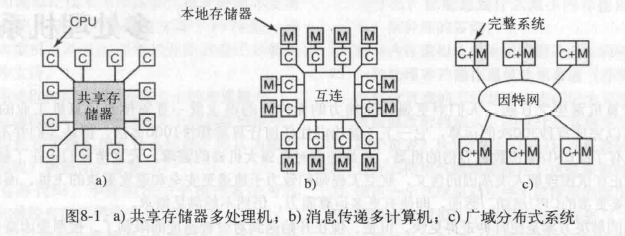
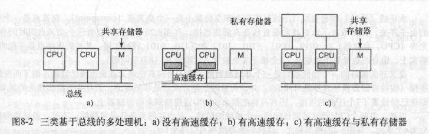
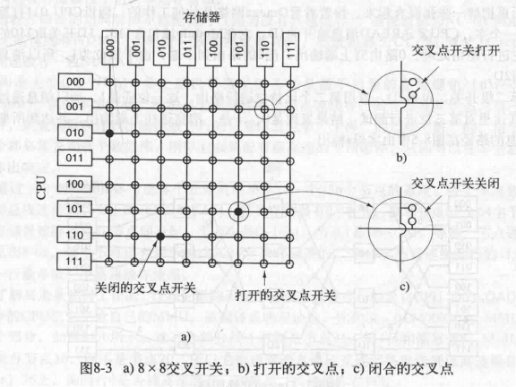
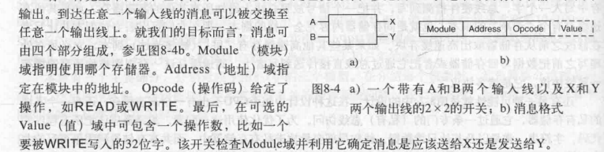
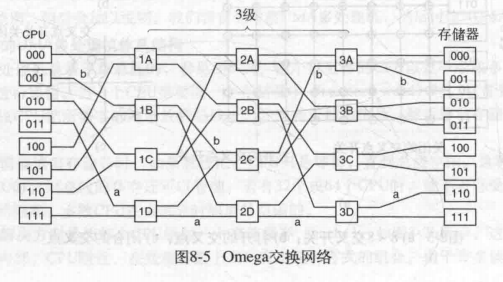

[TOC]

# 1 多处理机系统(multiple processor systems)
> 为了更强的计算能力,散热和可靠性
## 1.1 三种多处理机模型
> 核心问题: 通讯问题

### 1.1.1 共享存储器多处理机(shared memory model)
CPU通过一个共享存储器通信,每个CPU可同样访问整个物理存储器(1-10ns)
> 总线竞争问题
### 1.1.2 消息传递型多计算机(message passing multiprocessor)
每个存储器局部对应一个CPU且只能被该CPU访问,CPU通过互联网络通信(10-50us)
>请求数据是否在本地,交叉开关网络造价高
### 1.1.3 广域分布式系统(wide area distributed system)
所有计算机系统通过一个广域网连接(10-100ms)
>Internet不够可靠

## 1.2 多处理机硬件(multiprocessor)
> 即共享存储器多处理机

CPU通过一个共享存储器通信,每个CPU访问公用的RAM(1-10ns)
**UMA**(uniform memory access统一内存访问)多处理机:CPU访问每个存储器字的速度是一样快的(相反为NUMA)
运行在任意CPU上的程序得到普通的虚拟地址空间
为普通的操作系统
> 不同CPU对同一内存地址的修改--构成了处理器间通信的基础

### 1.2.1 基于总线的UMA多处理机

* 单总线
    > 受到总线带宽限制,无法充分利用CPU
* 带高速缓存
    * 许多操作读操作可以在本地高速缓存满足
    * 高速缓存块标记为只读(同时存在多个高速缓存中)还是读写(只能一个)
    * 高速缓存一致性协议: CPU试图在高速缓存写时,总线硬件发送一个信号到总线上.如果其他高速缓存有干净副本就丢弃,如有脏副本就赶紧写回或传送到写者
* 带高速缓存和私有存储器
    * 私有存储器通过私有总线访问,存放局部变量等

### 1.2.2 交叉开关UMA多处理机
> 单总线也只能维持16-32CPU

闭合的交叉点运行(CPU,存储器)同时连接
> 非阻塞网络(不会因为被占据而拒绝连接)
交叉点以$n^2$增长

### 1.2.3 多级交换网络UMA多处理机
> 基于简单2*2开关
* omega网络
n个CPU和存储器,需要$log_2n级$,每级n/2个开关

> 是一种阻塞网络(开关之间会冲突)

### 1.2.4 NUMA多处理机
特性:
1. 所有CPU统一地址空间(同UMA)(所以UMA程序可以在NUMA上跑,只是慢)
2. LOAD STORE访问远程存储器
3. 访问远程存储器慢于本地存储器

## 1.3 多处理机操作系统
### 1.3.1 每个CPU有自己的操作系统
使用同一套操作系统代码,但各自有自己的实例
* 问题: CPU没有进程共享,没有共享物理页面,无法有缓冲区高速缓存(每个操作系统独立维护导致矛盾)
### 1.3.2 主从多处理机(master-slave)
操作系统的副本和数据表都在主CPU上,所有系统调用重定向到主CPU
其余CPU向主CPU请求进程
* 问题: 主CPU会成为瓶颈
### 1.3.3 对称多处理机SMP(symmetric multiprocessor)
操作系统的副本在存储器中,进行系统调用的CPU运行操作系统陷入内核
* 问题: 不允许2个CPU同时运行操作系统(通过大内核锁BLK(big kernel lock))

可以把操作系统分为多个临界区,互斥访问,实现更多并行要求

## 1.4 多处理机同步
> 多处理器机并行的处理
### 1.4.1 TSL
并行状况下,同时发生的TSL会互斥失败
所以TSL锁要先锁住总线
但TSL变量的自旋锁循环测试,会不断请求包含锁变量的块并写入高速缓存(TSL需要写),但锁变量块的其他变量也会被拥有者使用,也会不断请求到高速缓存块中,所以这个块就在锁的拥有者和请求者之间来回穿梭(持续写导致穿梭)
> 解决: 先通过读判断锁是否空闲再用TSL(大部分行为变成读,两者可以以共享只读的方式拥有一个高速缓存快副本)

### 1.4.2 私有锁变量
未能获得锁的CPU分配一个私有锁变量并将CPU加入等待链表的末端.锁持有者退出时释放链表头的等待CPU的私有锁,该CPU进入临界区

### 1.4.3 自旋(spinning)或切换
> 自旋浪费了CPU周期(重复测试),切换也浪费CPU周期(保存当前进程上下文,高速缓存,TLB对下一进程不匹配)

## 1.5 多处理机调度 
### 1.5.1 分时(timesharing)
通过智能调度减少时间浪费
* 如持有自旋锁的线程时间片用完等待时,其他等待该锁的CPU会一直自旋,所以优先将该自旋锁线程处理完
* 减少高速缓存和TLB失效率,尽量将线程运行在先前的CPU上
### 1.5.2 空间共享(space sharing)
在多个CPU上同时调度多个线程
### 1.5.3 群调度(Gang Scheduling)
当一堆相关联进程需要执行时,每个进程分配专属CPU执行(如果CPU数不够等到够再一起执行)
> 方便线程间通信

## 1.6 多计算机(multicomputers)
>主要为计算机间通信
### 1.6.1 集群网络间发包
>可以直接将包拷贝到网卡上,减少拷贝
### 1.6.2 远程过程调用RPC(remote procedure call)
### 1.6.3 分布式共享内存(distributed shared memory) 
### 1.6.4 负载平衡(load balancing)
>均衡地为各计算机分布任务(请求帮助或志愿)

## 1.7 虚拟化(Virtualization)
### 1.7.1 第一类虚拟机管理程序(type 1 hypervisor)
直接运行在硬件上
### 1.7.2 type 2
运行在另一个操作系统上

## 1.8 分布式系统(distributed system)
> 主要解决计算节点交互的模式
 屏蔽底层实现
 
计算分布在各个计算节点上,计算节点合作完成目标
### 1.8.1 基于文档的中间件(document-based middleware)
> 中间件:操作系统和应用程序之间的,如网页协议的解析,方便开发
### 1.8.2 基于文件系统的中间件(file system based middleware)
> 以file为单位交换,如ftp协议
### 1.8.3 基于对象的中间件(object based middleware)
> 以对象为单位