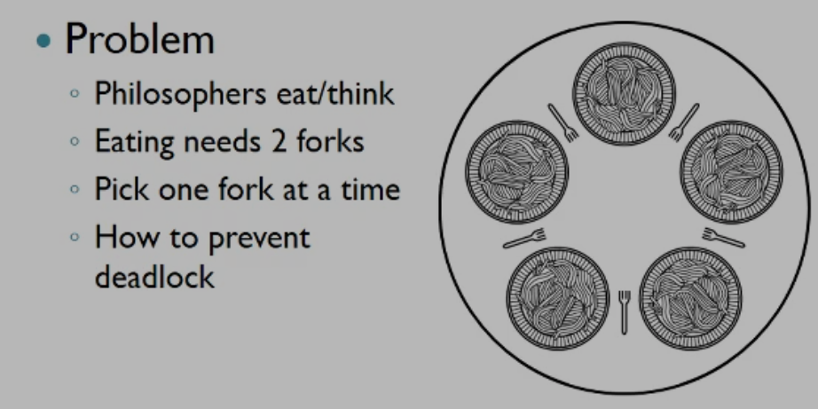
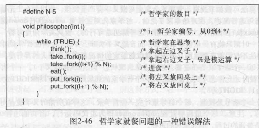
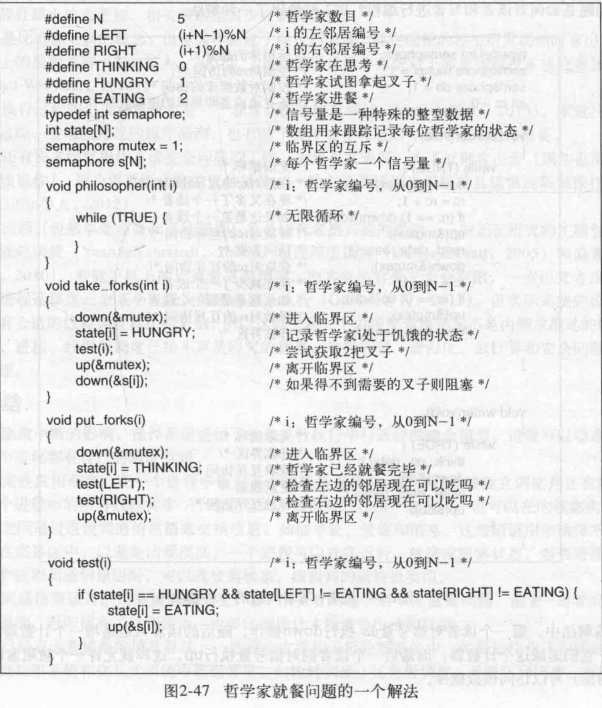
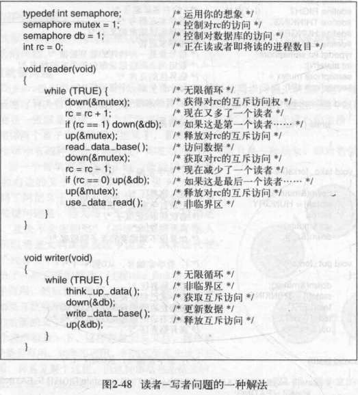
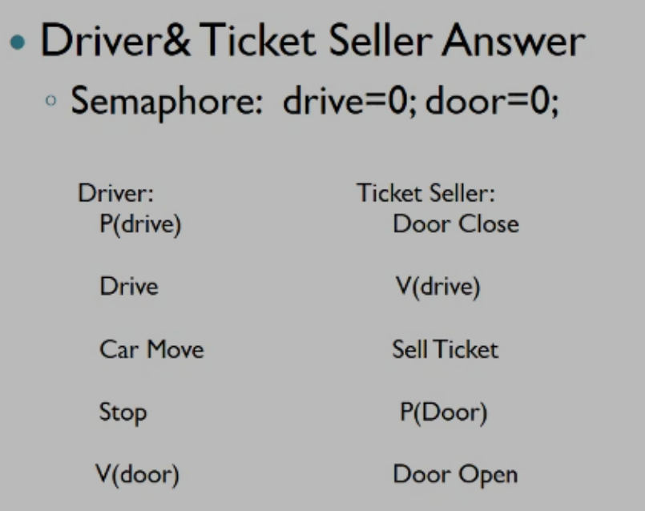

[TOC]

# classic IPC problem

## 哲学家就餐问题(Dining Philosophers Problem)

> 易产生死锁
### 错误解法

> 会死锁
### 解法

`while(true)
{
    think();
    take_forks(i);
    eat();
    put_forks(i);
}`
> 记录各个哲学家状态,每次尝试吃时检测相邻的两个哲学家状态
mutex保护状态表state[N],s[N]信号用于防止忙等待,用于同步操作(test()通过时s[i]为1,take_forks()才能最后down()执行下一步)

## 读者写者问题(The Readers and Writers problem)
### 读者优先解法

> mutex保护rc(读者数目),db保护数据库

## 睡眠的理发师问题(Sleeping Barber Problem)

## 司机售票员问题
> 司机可以 开车,停车  售票员可以开门,售票,关门
* 
>初始时drive和door都为0(加锁),司机第一步P(drive)被加锁等待,售票员关门后V(drive)解锁,司机立刻加锁drive开始行驶,司机停车后解锁V(door),售票员P(door)给门加锁,开门,此时两信号量都被加锁,如此循环

>通过信号量的传递实现交替运行,信号量只解锁一瞬间就被另一进程加锁
## 总结
>**一般来说**
* 同步: (一个达到了才允许另一个)
>设置信号量初值为0,等待者P(),先行者V()
* 互斥:
>设置信号量初值为资源数
