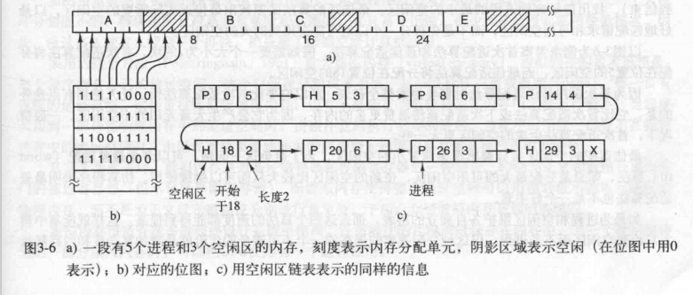
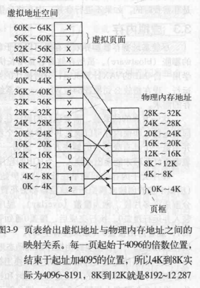
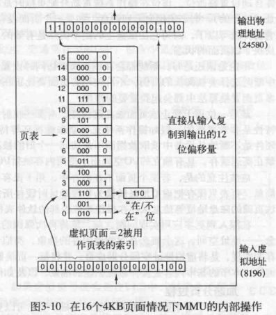
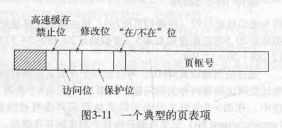
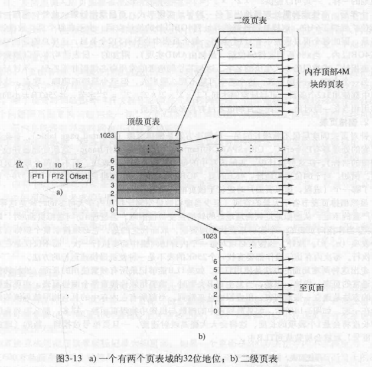
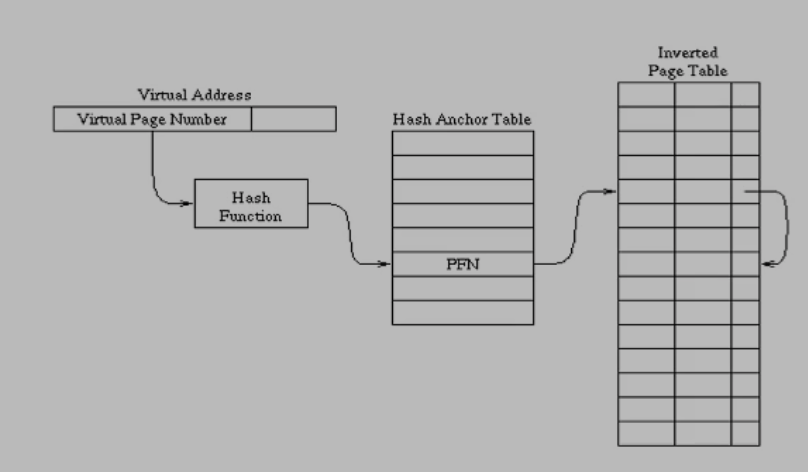

[TOC]

# 内存管理(Memory Management)

## 为什么需要内存管理
### 无存储器抽象(No Memory Abstraction)

#### 问题: 多进程时怎么实现
* 不知道程序加载内存的情况,绝对寻址会出错
#### 解决: 静态重定位(static Relocation):
>加载程序时遍历整个程序逐个修正地址加偏移量
> 程序都从0地址开始写,操作系统负责运行时修改到正确的地址
* 问题: 需要连续的物理内存
### 一种存储器抽象-地址空间
#### 动态重定位(Dynamic Relocation):稍微解决了需要连续物理内存的问题
>通过基地址寄存器(base register)(程序装载的首地址)和界限寄存器(limit register)(记录程序大小或最高地址),每次访问地址时加上基地址寄存器再和limit寄存器比较
* 问题: 所有剩余空间都不够新加载程序所需内存怎么办

引入
#### 交换技术(swap): 
>剩余空间不够时将老进程临时放到磁盘上
* 问题: 容易造成小内存碎片,基地址寄存器不够用
* 解决: 靠分页解决(规整化碎片)

## 空闲内存管理(Free Space Management)
### 位图(bitmap)
> 将内存划分成相同大小的分配单元(定长分配),每个分配单元对应位图中的一位,0.1表示空闲.占用
### 链表管理(list)
> 状态-起始位置-大小
一个简单的例子:(实现方式多)

> list相对优点: 寻找空闲区快
  list相对缺点: 每个节点占据空间较大,数据密度高时浪费空间

### list搜索算法
* 第一次适配(first fit)
    > 每次从开头找到第一个适配的
* 下次适配(next fit)
    > 从上次搜索的记录点开始遍历第一个适配的
* 最佳适配(best fit)
    > 遍历整条list找到适配的最小空闲区
****
## 虚拟内存(Virtual Memory)
> 解决问题: 程序比内存剩余空间还大的情况(部分加载)
虚拟存储: 每个程序都有从0开始的地址空间,地址空间分解成大小相同的页面
根据页面的交换: 碎片规整化,只有以页为单位的碎片

### 分页(Paging)
> 虚拟地址分为固定大小的页面,物理内存对应相同大小的页框
> 把虚地址转换到物理地址(CPU中MMU(Memory management unit)硬件负责)
### 虚拟页面
* 
    > 每个虚拟页面对应一个物理页面
    虚拟页面和物理页面大小相同,所以偏移地址在两个页面上相同
### 虚拟地址简单翻译
* 

### 页表(Page Table)
>虚拟页面号到物理页面号翻译
 一般存于主存
 每个进程一张
* 页表项
    
    > 像数组的访问方式,虚拟页号作为索引找到相应的页表项
    页框号存储物理页号
    阴影为保留位,给CPU自用

### 加速
#### TLB(Translation Lookaside Buffers)
> 页表的缓存,存于CPU
* 

### 削减页表大小
#### 多级页表(Multilevel Page Table)
> 虚拟地址存储各级页表的索引
* 
> 空的低级页表无须分配空间,在闲置空间很多时节省大量空间
  但效率低
#### 倒排页表(Inverted Page Table)
> 全局一张页表,有多少物理页面就有多少页表项
虚地址页面号(不同进程可能有相同的虚拟页号)通过哈希算出物理页面号(一个哈希值可能对应多个虚页号),再去倒排表(以物理页面号索引)(存储虚拟页面号和进程PID)(以哈希链连接),遍历此链直到找到逆转表中对应的页面
* 