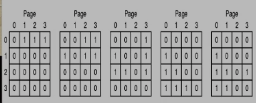

[TOC]

# 页面替换算法(Page Replacement Algorithms)
> page fault: 找不到页面
## 最优(Optimal)页面替换算法
> 替换最远的未来才会被使用的页面
不可实现的
用于评测其他算法
* 优点: 
    * 最小的page fault
## 最不近使用(LRU)(Least Recently Used)
> 替换最远的过去被使用的页面(最近没有使用过)
* 严格LRU:
    >  维护一个链表或记录各页面使用时间
    > 每次内存访问都要调整,开销大(淘汰)
    
    0,1,2,3,2   每次使用某页面矩阵行置1列置0,替换时找每行中二进制最小的替换(硬件实现)
* 近似LRU
    * NFU(Not Frequently Used)
        > 每个页面维护一个计数器,每次时钟中断查看各页面R位(01).加到计数器上
        每次替换计数器最小的页
        * 问题: 不会忘记任何事情,累加值会一直存在
        * 解决: 计数器每次时钟中断右移一位在最左边插入R位
    * NRU(Not Recently Used)
        > 每个页面有M位和R位,访问设R位写入设M位,定期清零R位(不清零M位起到写回标志作用)
        根据MR可将页面分为4类,替换时,没访问优先,后没修改优先
## Clock Page Replacement Algorithm
> 循环存储各页面,page fault 发生时通过一个指针,指向的页面R位为0则替换,R位为1则置0指向下一个继续.

## 工作集(Working Set Page Replacement Algorithm)
>不同的任务用不同的工作集(不同的页面集合)
记录每个页面上次被访问时间ltu(近似),page fault时计算当前时间和ltu的时间差,时间差>t(关键是如何设置t)则替换,没有则替换时间差最大的

## FIFO Page Replacement Algorithm
> 先进先出
维护一张链表
* 缺点: 内存增加可能提高page fault

## Second Chance Page Replacement Algorithm
> 页面存于队列,替换时如表头页表R位为1则R置0放到队尾